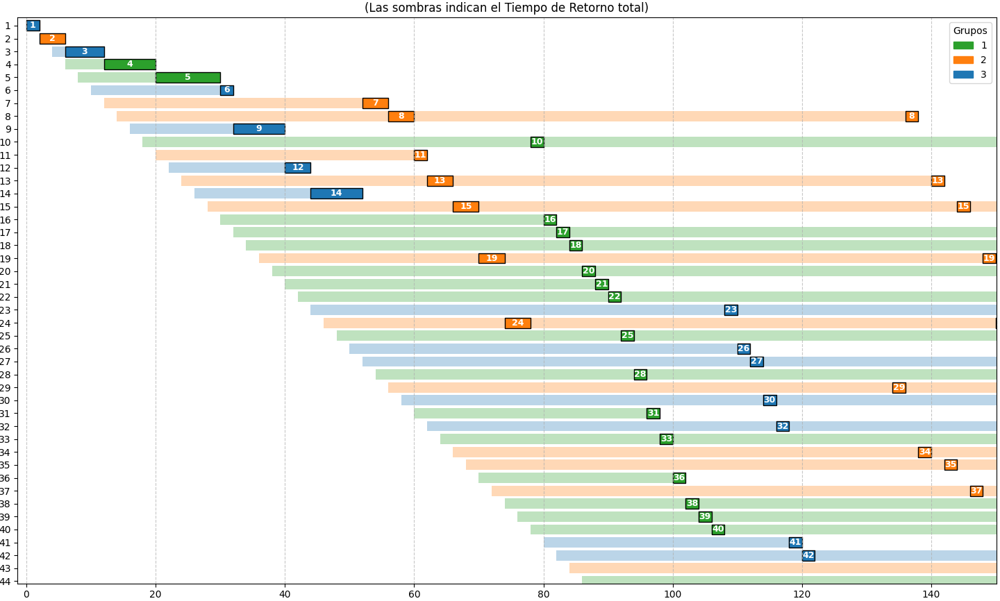

# FSSS - Fair Share Scheduling Simulator

Este proyecto es un simulador de planificación de procesos para la CPU basado en el algoritmo **Fair Share Scheduling**, donde se usa un sistema de **Round Robin interno** para garantizar una distribución equitativa tanto a nivel de grupos como de procesos.

## Sobre el Algoritmo

El algoritmo implementado divide el tiempo de la CPU de la siguiente manera:
1. **Asignación por grupos:** El sistema asigna un *quantum global* que se divide equitativamente entre todos los grupos de procesos que tengan procesos listos para ejecutarse en ese momento.
2. **Round robin interno:** Una vez que un grupo recibe su fracción de tiempo (quantum de grupo), este tiempo se vuelve a dividir en partes iguales entre todos los procesos activos pertenecientes a ese grupo. 

Esto evita que un grupo con muchos procesos monopolice la CPU, garantizando que todos los grupos avancen al mismo ritmo, independientemente de la cantidad de procesos que contengan.

## Requisitos

* Python 3.7 o superior.
* [**`uv`**](https://github.com/astral-sh/uv) (Recomendado)

El proyecto requiere la librería `matplotlib` para la generación del diagrama de Gantt. La forma más sencilla de ejecutar este proyecto sin modificar tu entorno global es usar `uv`.

## Uso

El simulador se ejecuta como una herramienta de línea de comandos. Requiere tres parámetros obligatorios para funcionar:

* `-p` o `--procesos`: Ruta al archivo de texto que contiene la lista de procesos.
* `-g` o `--grupos`: Cantidad de grupos entre los que se dividirán los procesos.
* `-q` o `--quantum`: Valor numérico del Quantum Global del sistema.

Adicionalmente tiene los parámetros opcionales:

* `-s` o `--sort`: Ordena el diagrama de Gantt por ID del proceso.
* `-o`, `--output`: Ruta de salida para el diagrama de Gantt. Si no se pasa este parámetro, se intentará crear una ventana de matplotlib para mostrar el diagrama.


**Ejecución recomendada usando `uv`:**
Ejecuta el script agregando matplotlib como dependencia:
```bash
uv run --with matplotlib fsss.py -p procesos.txt -g 3 -q 6
```

## Ejemplo de salida:

```
=======================================================
      MÉTRICAS PROMEDIO DEL SISTEMA
=======================================================
Tiempo de Respuesta Promedio Global: 54.06
Tiempo de Espera Promedio Global:    267.25
Tiempo de Retorno Promedio Global:   273.25
-------------------------------------------------------
      PROMEDIOS POR GRUPO
-------------------------------------------------------
Grupo | Respuesta |    Espera |   Retorno
-------------------------------------------------------
1 |     54.60 |    284.62 |    290.62
2 |     57.65 |    314.12 |    319.73
3 |     45.80 |    138.75 |    145.55
=======================================================
```




